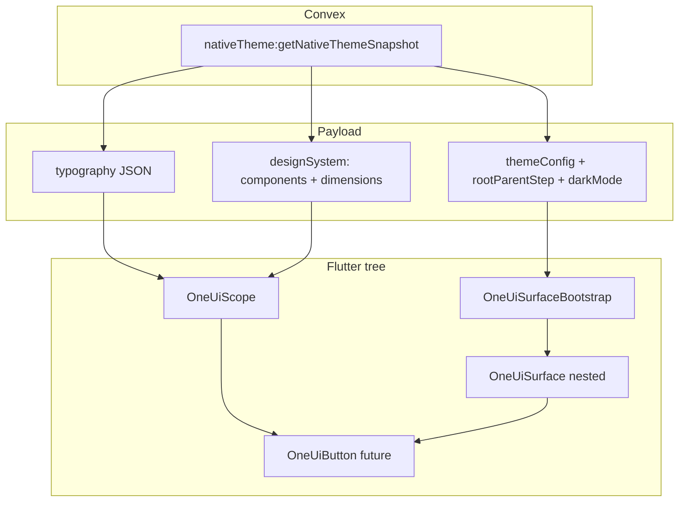

# Flutter: Convex native theme parity and Button pipeline

This document ties **what Convex returns** to **what Flutter should consume**, and mirrors the **React / React Native Button architecture** so a future Flutter `OneUiButton` can follow the same layering.

## 1. Convex → Flutter data map

| Source | Field(s) | Flutter consumer |
|--------|-----------|-------------------|
| `nativeTheme:getNativeThemeSnapshot` | `themeConfig.appearances` | `OneUiSurfaceBootstrap` → `ThemeConfig` / `ScaleDefinition` per **appearance role** (primary, neutral, …) |
| | `rootParentStep`, `darkMode` | Root surface anchor (2500 light / 100 dark) |
| | `rootRoles` | Optional debug / fast path; runtime resolution uses `themeConfig` + `OneUiSurface` + `resolveRolesInsideSurface` |
| | `typography` | `NativeTypographySnapshot` on **`OneUiScope.nativeTypography`** → `TextStyle` via `emphasisStyle` / `fixedRoleStyle` |
| | `designSystem.componentCustomProperties` | **`OneUiScope.designSystem`** — `--Button-*`, spacing, radii; `var(--*)` resolved against dimensions map |
| | `designSystem.dimensionContexts` / `activeDimensionContext` | Same `designSystem` — f-steps, spacing aliases, grid, shapes; used by **`OneUiScope`**, **`NativeDesignSystemPayload`**, and **dimensions foundation pages** (Storybook resolves **Convex slice first**, then `platformsFoundationConfig`, then static tables — matches TS `buildStructuredDimensionContexts`). |
| | `meta.configuredRoles` | Aligns with keys under `themeConfig.appearances` |
| `getBrandOverviewData` (still used in Storybook) | `platforms.config` | **`OneUiScope.platformsFoundationConfig`** — dimensions / strokes when interpolating like web `generateDimensionCSS` |
| | `typography.config`, `customFonts` | **`OneUiScope.typographyConfig` / `customFonts`** — typography **foundations** pages (Dart re-resolution); snapshot `typography` is authoritative for **resolved** numeric styles |

**Strokes:** Flutter Storybook mirrors web `Strokes.stories.tsx` (Static / Dynamic / All). **`resolveStrokeWidth`** resolves static px (optional snapshot override); dynamic tier reads `--Dimension-f{N}` from `designSystem.dimensionContextFor(platform, density)`, then `getDimensionValue` with `platformsFoundationConfig`, then static tables. Preview bar uses brand primary bold.

## 2. Architectural alignment: web vs RN vs target Flutter

### React (web) Button

1. **Brand CSS** — `useBrandCSSNew` injects tokens into `@layer brand` (surfaces, typography, dimensions, component overrides, ornaments).
2. **Surface context** — Parent `<Surface mode="…">` sets `[data-surface]";` children read remapped `--Primary-*`, `--Text-*`, etc.
3. **`Button.tsx`** — Base UI primitive + `Button.module.css`: consumes intermediate `--_btn-*`, variants (`bold` / `subtle` / `ghost`), sizes (`data-size`), `appearance*` classes, **ornaments** via `useComponentDecoration` / CSS vars.
4. **No runtime TS colour math in Button** — colours are **CSS variables** resolved by the engine-injected cascade.

**8-digit hex on web:** Browsers parse `#RRGGBBAA` (alpha **last**) per CSS Color 4. Some brands store **Flutter / Android `#AARRGGBB`** words (for example `#FFE62828` = opaque `#e62828`). Without normalisation those tokens look nearly transparent → **Bold** buttons lose their fill while Subtle/Ghost still read fine. **`@oneui/shared` CSS generation** (`cssGenNew` + `normalizeSolidCssHex` / `parseRgbFromHexLoose`) rewrites emitted solid fills to canonical `#rrggbb`; the parser prefers **ARGB** whenever the leading octet is full alpha (`0xFF…`), except explicit **pastel translucent CSS** (`#FFEEDD80`) and near‑white tails — matching Flutter `oneUiHexColor`.

**Regression note:** Using only “CSS alpha &lt; 0x40” to detect ARGB is wrong: for `#FF0053C8`-style blues the misread alpha is the **blue byte** (often ≥ 0x40), so the engine used to corrupt `--Primary-Bold` RGB to `(255, 0, 83)` and high-attention UI vanished for Jio / Reliance-class palettes.

**Flutter-only gap (fixed):** `packages/ui_flutter/lib/engine/color_math.dart` **`hexToRgbTuple`** previously matched **6-digit** hex only. Convex palettes with **`#AARRGGBB`** stops made **`preParseRGBPalette`** store **`(128,128,128)`** for every step, so **`computeContrastDir`**, **`resolveSurface` chaining**, and **`walkForContrast`** (tinted / on-bold labels) were computed on **grey** — Bold (high-attention) collapsed while Subtle/Ghost could still appear plausible. **`hexToRgbTuple`** now delegates to **`oneUiHexColor`** so the surface engine matches **`@oneui/shared`** geometry.

### React Native Button

1. **`OneUINativeTheme`** from `buildNativeTheme` (same inputs as Convex snapshot).
2. **`Surface`** — `resolveSurface` + **`resolveNativeContextRoles`** at child step (Flutter Storybook uses **`resolveRolesInsideSurface`** for web `[data-surface]` parity for nested anchors).
3. **Button** — Reads **`useSurfaceTokens(appearance)`** for colours; typography from theme or style objects; no CSS.

### Target Flutter (same pattern)

1. **Data** — `NativeThemeSnapshot` from Convex (or fixture JSON).
2. **Scope** — `OneUiSurfaceBootstrap` + nested **`OneUiSurface`** pushing **`resolveRolesInsideSurface`** per boundary.
3. **Typography / dimensions / components** — `OneUiScope`: `nativeTypography`, `designSystem`, `platformsFoundationConfig`, `platformId` / `density`.
4. **Future `OneUiButton`** — Composes:
   - **Colours** from `OneUiSurfaceScope.tokensOf(appearance)` (or equivalent role maps), not hard-coded hex.
   - **Layout** from `designSystem` (`--Button-*` + resolved `var(--Spacing-*)`).
   - **Typography** from `OneUiScope.nativeTypography!.emphasisStyle('label', size, emphasis: 'high')` aligned with web `Label-*` + weight.
   - **Ornaments** — `resolveButtonOrnamentLayers` + `buttonOrnamentSideRendered` mirror web `ButtonDecoration` / RN: open ornament path, pill fill tied to **`--_btn-bg` body colour only** — web `.ghost` zeros inset decoration stroke (`--Button-cssDecorationInsetStrokeWidth-active: Spacing-0`; colour `transparent`), so Flutter emits **fill-only ornament SVG** (no detached stroke silhouette on transparent ghost/low attention). **SVG fill hex must encode alpha** (`svgCssColorHex` → `#RRGGBB` opaque or `#RRGGBBAA`); opaque-only RGB wrongly turned `Colors.transparent` into **`#000000`** in `flutter_svg`. **Vertical size** mirrors `calc((100% + 2*--_btn-bw) * ornamentHeightScale)`: `%` reads **actual laid-out button height** (not token `minHeight` alone), so **size L + slots** keeps cap ends aligned when the row is taller than the min-height token.

## 3. What is already reflected in Flutter Storybook

- **Appearance / surfaces** — `themeConfig` + surface engine + context remapping.
- **Typography (resolved)** — `nativeTypography` on scope; used by `OneUiButton` label styles (`Label-*`, emphasis high).
- **Dimensions** — Toolbar platform/density + `platformsFoundationConfig` + snapshot **`designSystem`** for f-steps used by strokes and component `var()` resolution.
- **Component tokens (subset)** — `designSystem.componentCustomProperties`; Foundations **Surfaces** uses real **`OneUiButton`** rows (Bold / Subtle / Ghost), not simplified chips — same Convex keys as web `Button`.

### Same Convex merge as Web — interpretation must match viewport

Both surfaces merge **`componentThemeSelections` + `recipeSelections` + filtered `tokenOverrides`** the same way:

| Delivery | Pipeline |
|---------|----------|
| **Web Storybook** (`BrandStyleDecorator.tsx`) | `useBrandCSS` · `generateDimensionCSS` → **`[data-Breakpoint][data-6-Density]`** · `buildAllComponentCSS(getAllBrandComponentData)` → component `<style>` |
| **Flutter snapshot** (`nativeTheme:getNativeThemeSnapshot`) | `buildNativeTheme` · `designSystem.dimensionContexts` (`buildStructuredDimensionContexts`) · **`buildAllComponentCustomPropertiesFlat`** (**same merge** as web `buildAllComponentCSS`) |

So **`--Button-borderRadius`** and other **`--Button-*`** resolved entries are **the same strings** Web injects and Flutter reads from `designSystem`. If both sides show a **rounded rectangle** instead of a **capsule**, the flat map likely carries a modest **`Shape-*`** token for **`--Button-borderRadius`** — that is **not** a Flutter rendering bug; align by coercing to **`var(--Shape-Pill)`** (retail Tira does this in **`buildAllComponentCSS`**, **`nativeTheme`**, and Flutter Storybook **`normalizeStorybookTiraRetailCapsuleButtons`**).

**Why `--Shape-*` / spacing could still diverge**

- **Web**: the browser resolves `var(--Shape-2)` → `var(--Dimension-f4)` → **px** against the **`[data-Breakpoint]`** block for the **preview iframe width**.
- **Flutter**: **`resolveCSSValue`** walks `var()` and reads **`dimensionContextFor(OneUiScope.platformId, density)`**, where **`platformId`** comes from **`viewportToV2PlatformId`** (story column width).
- Convex **`nativeTheme`** also passes **`platform: mobile|tablet|desktop`** into **`buildNativeTheme`** → **`mapNativePlatformToV2DimensionPlatform`**. That must agree with the canvas v2 id. **Responsive** Flutter Storybook historically queried **`mobile`** while a wide canvas used **`L`**, skewing typography and defaults vs Web desktop — **`apps/storybook_flutter/lib/main.dart`** now sets the Convex **`platform`** argument from **`viewportToV2PlatformId(columnWidth)`** after layout.

### iOS / Android (same codebase as Flutter web)

- **Foundations + `OneUiButton`** consume the identical **`NativeThemeSnapshot` → `OneUiSurfaceBootstrap` → `OneUiScope`** wiring on mobile emulators/devices; nothing in `packages/ui_flutter` is gated to web-only embeddings.
- **Viewport / Convex platform** — Narrow phone canvases yield **`S`/`mobile`** payloads the same way a small web iframe does; **`nativeTheme`'s `platform` argument stays in sync** with the responsive story column (**`main.dart`**).
- **Network** — **Android**: declare **`INTERNET`** in **`android/app/src/main/AndroidManifest.xml`** for release/profile Convex HTTP (**`apps/storybook_flutter`**). Pass **`CONVEX_URL`** via **`--dart-define-from-file`** when IDE launches skip repo `.env.local`.
- **A11y** — Semantics tree checks run on **every** embedding; **`axe-core`** stays **Flutter web** only (embedding + CDN). **`MaterialApp.showSemanticsDebugger`** works on iOS/Android like desktop.

## 4. Flutter Button Storybook (implemented)

- **Sidebar:** `Components → Button` with one leaf per web `Button.stories.tsx` export (+ **Convex coverage** diagnostic).
- **Widget:** **`OneUiButton`** — colours from `OneUiSurfaceScope`, layout/typography from `designSystem.componentCustomProperties`; orange `ConvexGapCard` when keys are missing. Flutter does not ship **`LinkButton`**; the `contained` prop is retained for signature parity only.
- **Focus:** Keyboard focus halo via `OneUiFocusInteractive` + `resolveOneUiFocusRingSpec` (two-layer box shadow: `--Stroke-XL` gap using `--Surface-Halo-Gap`, outer `--Focus-Outline` / `--Focus-Outline-Width`). Shown when Flutter is in traditional keyboard highlight mode. Contained buttons omit the web CSS inset border shadow for now.
- **Accessibility (WCAG-aligned patterns)** — `OneUiFocusInteractive` merges **`Semantics(button: true)`**, **`Semantics.enabled`**, **`label`/`hint`**, **`expanded`** (`aria-expanded` parity), **`Semantics.controlsNodes`** (**`aria-controls`** on Flutter web when targets expose matching **`Semantics.identifier`**), **`semanticsBusy`** (`aria-busy`), and **`excludeFromSemantics`** (`aria-hidden`). During **`loading`**, the visible label is **`ExcludeSemantics`**-hidden while a sibling **`CircularProgressIndicator`** carries **`Semantics(label: Loading)`**, matching **`Button.native.tsx`** (**`busy` + dedicated spinner subtree**) for coherent name/role/value on TalkBack, VoiceOver, and Flutter web screen readers.
- **Motion / press feedback** — Shared **`AnimationController`** in **`OneUiFocusInteractive`** drives **tap shrink** (**`Transform.scale`** from **`tapMotion`**) plus optional **`pressAnimationBuilder`**. Buttons **`Color.lerp`** **`resolveButtonColors(...).background` → **`backgroundPressed`** (**`--Button-*-pressed`** cascade / role **`Bold-Pressed`** / **`Subtle-Pressed`** / **`Pressed`**). Timing resolves from **`--Button-transitionDuration`** / **`--Button-transitionEasing`**; **`MediaQuery.disableAnimations`** snaps **`AnimationController`** values.
- **Shape / corner radius** — `--Button-borderRadius` resolves through `resolveComponentLengthPxCascade` mirroring web `Button.module.css` (`var(--Button-borderRadius, var(--Shape-Pill))`). **`--Shape-Pill`** resolves as **`9999px`** (stadium pill) via `lengthPrimitiveSansPlatformDims`, **before** dimension slices — so malformed `--Shape-Pill` rows in JSON cannot squash pill buttons.
- **Button fill tokens** — Convex often stores `--Button-roleBold: var(--Primary-Bold)`. That reference is **not** in `designSystem.componentCustomProperties`, so `resolveCSSValue` stops at a dangling `var(--Primary-Bold)`. **`resolveButtonTokenColor`** peels the leading `var()` and resolves `--Primary-Bold` from `OneUiSurfaceScope` palettes (browser-equivalent to brand-injected CSS). Without it, **Bold** buttons can render as text-only on some brands (e.g. Tira).
- **`--Primary-TintedA11y` vs on-bold tokens** — **`--Primary-TintedA11y`** (no `Bold-` infix) is **default-surface tinted label colour** (`role.content`). Web **outline/quiet** emphasis sets **`--Button-textColor-bold`** to **`var(--Primary-TintedA11y)`**. Text drawn **on top of a filled bold pill** uses **`Bold-TintedA11y`** / **`--Primary-Bold-TintedA11y`** (`onBoldContent`). Flutter formerly treated plain **`TintedA11y`** like on-bold — **near-white ink on a white docs canvas** — so outline-style brands (Tira, Reliance) looked broken while **subtle/filled Medium** stayed fine.
- **Outline “High” chrome (`::after`)** — **`actions` → `emphasisStyle: outline`** sets **`--Button-backgroundColor-bold: transparent`**, **`--Button-borderWidth-bold: 0px`**, and paints the pill with **`--Button-cssDecorationInsetStrokeWidth-bold`** (+ colour) on web **`.button::after`**. **`OneUiButton`** synthesizes a **`Border.all`** from those tokens when there is no width/colour ring from **`borderWidth`/`borderColor`**, so embedded Flutter (full Convex map) still shows a **stroked outline** High like web. **`solid`** brands keep **`--Button-cssDecorationInsetStrokeWidth` → `Spacing-0`** in the flat map, so filled Jio/Swadesh pills do not gain an extra outline.
- **Flutter Storybook colours** — Canvas uses Convex **`designSystem`** verbatim (no stripping outline **bold** overrides). **`normalizeStorybookTiraRetailCapsuleButtons`** only patches **shape** (Tira capsule radius). **`themeConfig` / `rootRoles`** palettes and token maps are normalised on ingest (`normalizePaletteHexForEngine`) so nested surface resolution matches web **`normalizeSolidCssHex`** / `#AARRGGBB` handling. Root roles use the full per-role Convex snapshot (no token-by-token merge with Dart recompute).
- **Button ornaments / Swadesh brackets** — Same layout model as web: `Button.module.css` reserves footprint with horizontal margin `--Button-ornament-width-*`, while inner artwork uses **absolute overlap** (`ButtonDecoration.tsx`). Flutter mirrors this with **`Padding` + `Stack` (`clipBehavior: none`) + `Transform.translate`** so ornament SVG columns meet the squared inner pill corners (not an in-flow `Row`). Ornament height tracks **`(minHeight + 2 × borderWidth) × --Button-ornamentHeightScale`**, aligned with **`calc((100% + border×2) × scale)`** on web. Silhouette **stroke** on the ornament path mirrors TSX **`[data-ornament-stroke]`** when **`--Button-cssDecorationInsetStrokeWidth-*`** resolves non-zero (**ghost** falls back to button border width like the TSX fallback).

### ARIA relationship props (`Button.native` ↔ Flutter)

- **`aria-controls` / RN `accessibilityControls`** — `OneUiButton.semanticsControlsSemanticsIdentifiers` forwards to **`Semantics.controlsNodes`**. Each string must equal a **`Semantics.identifier`** on the described/controlled subtree. On **Flutter web**, the engine resolves these to **`aria-controls`** pointing at `flt-semantic-node-{id}` elements (same pattern as `Tab`/`ExpansionTile`).
- **`aria-describedby`** — RN forwards to **`accessibilityLabelledBy`** on `Pressable`; Flutter still has **no first-class arbitrary `aria-describedby`/`describedByNodes` mapping for `Semantics(button: true)`**. Use **`semanticsHint`** (and/or visible helper copy in the subtree) until the embedder exposes ID references for buttons.
- **`aria-haspopup`** — Flutter web’s **`role="button"`** node does **not** set **`aria-haspopup`** (engine only attaches it on certain **`menuItem`** roles when expand state applies). Prefer **`MenuAnchor` / `PopupMenuButton`** (or downstream composition) where the adaptive menu/menu-item semantics subtree supplies the popup relationship; **`OneUiButton`** stays aligned with Storybook **`Button`'s** baseline **`<button>`** semantics (`aria-busy`, `aria-disabled`, `aria-expanded`, name, keyboard).

### Other Flutter Storybook notes

- **Ornament micro-parity** — Stroke width differs from web **`vector-effect: non-scaling-stroke`** after non-uniform SVG scale; manual visual vs Storybook Web (focus ring radius on squared sides; press tint on ornament fills vs web).
- **Typography foundations page** — Still demonstrates Dart resolution from `typographyConfig`; component buttons use snapshot `nativeTypography`.

## 5. References

- TS engine: `packages/shared/src/engine/buildNativeTheme.ts`, `buildNativeTypography.ts`, `surfaceNew.ts` (`resolveContextTokenSet`).
- Convex: `packages/convex/convex/nativeTheme.ts`.
- Web Button: `packages/ui/src/components/Button/Button.tsx`, `Button.module.css`.
- RN Surface: `packages/ui-native/src/theme/SurfaceContext.tsx`.
- Flutter: `packages/ui_flutter/lib/engine/theme_strategy.md`, `native_typography_snapshot.dart`, `native_design_system_payload.dart`.
