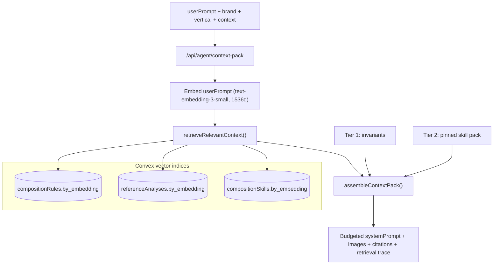

# RFC 0002 — Hybrid RAG for the Design Composition Agent

Status: **Implemented, flag-gated** (2026-04-21)
Owner: Design System team
Drivers: Design Composition Agent scalability audit (2026-04-21)

## Problem

The Design Composition Agent (DCA) currently assembles its LLM system prompt via `assembleContextPack()` in [`packages/shared/src/engine/contextPack.ts`](../../packages/shared/src/engine/contextPack.ts). That function compiles **every** active brand rule and **every** curated reference into a single ~12 KB prompt, trimming reference analyses to a pointer line only when the running total exceeds the budget.

This works at today's scale (Jio + a handful of brands, ~12 rules per brand, ~20-30 curated references) but does not hold up as the platform grows:

1. **Prompt bloat.** With 7+ verticals (entertainment, e-commerce, finance, telecom, governance, farm, iot...) each needing 20+ vertical-specific rules and hundreds of reference screens, "compile everything" produces prompts that exceed realistic context budgets and force aggressive trimming of the most valuable content (vision-analysis summaries).
2. **"Lost in the middle" accuracy loss.** LLMs exhibit well-documented accuracy degradation for information buried in the middle of long prompts. A 30 KB prompt of rules and references is worse for generation quality than a 6 KB prompt containing only the rules relevant to the current request.
3. **Linear cost scaling.** Every new rule/reference/skill added to the library increases the token cost of **every single generation**, regardless of relevance. This creates a disincentive to grow the knowledge base.
4. **Closed training loop.** The user can "train" the agent by uploading reference images and editing rules, but that training has diminishing returns: more training data means each individual piece gets less prompt real estate.

## Decision

Adopt a **three-tier hybrid retrieval** architecture:

| Tier | Source | Size | When it's included |
|------|--------|------|--------------------|
| 1. **Invariants** (deterministic) | Core rules from `COMPOSITION_SEED_SECTIONS` + brand summary + context preset | ~2 KB | Always |
| 2. **Skill pack** (deterministic) | The skill resolved by `skillId` / `(vertical, archetype)` match | ~2-3 KB | When a skill is pinned or matched |
| 3. **Retrieved** (RAG) | Top-k rules, references, and un-pinned skills by vector similarity to the user's prompt | ~3-4 KB | Every generation; driven by semantic similarity |

This preserves what works today — invariants and skill packs stay deterministic, predictable, and auditable — while replacing the "compile everything" tail with a relevance-driven retrieval step.

### Why not pure RAG?

Pure RAG over all rules and references would:
- Destroy the intentional hierarchy of invariants (layout-structure, surface-usage, typography-roles, zero-literals) that **must** always be present,
- Break skill packs, which are deliberately-curated bundles of rules + references for a named pattern (e.g., `ecommerce-product-grid`),
- Reintroduce non-determinism in scenarios where deterministic behaviour is a feature (pinned skill requests, evaluation runs).

### Why not keep "compile everything"?

Because it does not scale past the current library size, and the user has explicitly asked for the agent to "generate better UIs following our rules" in a "big company" with "many verticals". That goal demands a larger library, which demands retrieval.

## Architecture



### Precedent: knowledgeDocs

This repo already runs a vector RAG pipeline for design-system documentation: [`packages/convex/convex/knowledge.ts`](../../packages/convex/convex/knowledge.ts) + [`scripts/ingest-knowledge.ts`](../../scripts/ingest-knowledge.ts). The composition RAG mirrors that exact shape:

- Same embedding model (`text-embedding-3-small`, 1536 dimensions).
- Same caller-embeds-query pattern (Next.js route embeds, Convex action searches).
- Same `.vectorIndex('by_embedding', { vectorField: 'embedding', dimensions: 1536, filterFields: […] })` declaration.
- Same idempotent upsert-by-hash strategy for ingestion.

No new infrastructure is introduced: OpenAI and Convex vector search are already in the build.

### Data-model changes (Phase 1)

Three existing tables gain two optional columns and one vector index each:

1. `compositionRules`: `embedding`, `embeddingHash`; filter fields `brandId, vertical, scope`.
2. `referenceAnalyses`: `embedding`, `embeddingHash`, denormalised `archetype`, `vertical`; filter fields `archetype, vertical`.
3. `compositionSkills`: `embedding`, `embeddingHash`; filter fields `brandId, vertical, archetype`.

All fields are optional so existing rows continue to work — rows without an embedding are simply invisible to retrieval and served by the legacy full-compile path. This means the migration is zero-downtime and reversible via the feature flag introduced in Phase 6.

### Retrieval contract (Phase 3)

```ts
retrieveRelevantContext({
  brandId: Id<'brands'>;
  vertical?: BrandVertical;
  context: CompositionContext;
  archetype?: string;
  queryEmbedding: number[];          // caller embeds the userPrompt
  topK?: { rules?: number; references?: number; skills?: number };
}): Promise<{
  rules: CompositionRule[];          // merged with invariants, de-duped
  references: ScoredReference[];     // merged with pack refs, de-duped
  skills: CompositionSkill[];        // ignored when skillId is pinned
  trace: {
    query: string;
    hits: Array<{ kind: 'rule'|'reference'|'skill'; id: string; score: number; reason: string }>;
  };
}>
```

`retrieveRelevantContext` is a pure function — the Convex action does the IO, the shared engine merges, de-dupes, and returns. Callers (route, executor, eval) are identical.

## Tiers in detail

### Tier 1: Invariants (always-on)

Rules whose `sectionId` is in `INVARIANT_SECTION_IDS` are included in every prompt regardless of retrieval scores. The invariant set:

- `layout-structure` — how screens are composed.
- `surface-application` — `<Surface>` usage, `data-surface` remapping, bold inversion.
- `typography-hierarchy` — role-based typography tokens.
- `component-selection` — token-only styling, no literals.
- `accessibility-layout` — WCAG AA requirements.

These five are non-negotiable; retrieval augments them, never replaces them.

### Tier 2: Pinned skill pack (deterministic)

If the request carries `skillId`, or the (vertical, archetype) tuple matches a named skill, the skill pack is loaded as-is via `compositionSkills.getPack` — same behaviour as today. Retrieval is **disabled for skills** in this case (tier 3 only retrieves un-pinned skills).

### Tier 3: Retrieved (RAG)

For every generation the route embeds the user prompt and runs three vector searches in parallel:

- `compositionRules` filtered by `(brandId, vertical)` → top `rules.k` (default 5).
- `referenceAnalyses` filtered by `(archetype OR vertical)` → top `references.k` (default 3).
- `compositionSkills` filtered by `(brandId, vertical)` → top `skills.k` (default 1). Skipped when `skillId` is pinned.

Results are de-duplicated against tiers 1 and 2 (invariants and pack) and merged into the `rulesForCompile` + `fallbackReferences` arrays that `assembleContextPack` already accepts.

## Performance envelope

| Metric | Today | Target |
|--------|-------|--------|
| Prompt size (cold) | 12 KB hard cap, often trimmed | 5-7 KB |
| Prompt size (cached hit) | 12 KB | <1 KB (cache metadata) |
| Per-generation embedding cost | — | ~$0.00002 (`text-embedding-3-small`) |
| Vector search latency | — | <100 ms per index (Convex managed) |
| Backfill one-off cost | — | ~$0.05 total (500 rules + 1000 analyses + 50 skills) |
| Pass rate on eval suite | Baseline (Phase 0) | ≥ baseline |

Cache TTL stays at 1 hour; the cache key gains a `djb2(userPrompt ?? '')` component so identical prompts still hit cache but different prompts correctly miss.

## Baseline (Phase 0)

At the time of this RFC there is **no automated composition eval harness** yet (`packages/shared/src/engine/__tests__/` has no `composition*.test.ts`). The Convex `compositionEval` table exists and is populated via the evaluation page UI, but there is no test-runner integration.

This means the "baseline" for this RFC is qualitative:

- **Prompt size** measured by the `size` field returned from the current `/api/agent/context-pack` route on three sample requests: Jio marketing page, JioCinema mobile app, JioMart product grid. (Run these manually via the evaluation page before rolling out Phase 6.)
- **Pass rate** tracked via designer feedback in the `compositionFeedback` table over a 2-week window before and after rollout.

Building an automated test harness is **out of scope for this RFC**; it can be added as a follow-up once we have telemetry from Phase 6.

## Rollback plan

The entire feature is gated on `COMPOSITION_RAG_ENABLED` (Phase 6). When the flag is false, `assembleContextPack` uses the existing full-compile path and ignores any `retrievedRules`/`retrievedReferences`/`retrievedSkills` inputs. Turning the flag off is instantaneous and does not require a schema migration.

If a bug in retrieval corrupts the prompt, the fix is: flip the flag, triage, re-deploy. The schema changes are additive and optional, so they carry zero ongoing runtime cost when the flag is off.

## Non-goals

- Fine-tuning any model. All "training" remains designer-curated rules, references, and skills; retrieval is a retrieval mechanism, not a learning mechanism.
- Replacing invariants or skill packs with retrieval — those stay deterministic.
- Building a new vector database — Convex vector search is sufficient and already in the build.
- Changing the brand CSS engine, component registry, or the UI layer beyond adding a retrieval-trace debug panel.
- An automated composition eval harness — tracked separately.

## Rollout & telemetry (Phase 6)

### Flag

- Environment variable: `COMPOSITION_RAG_ENABLED`. Read by the single helper [`apps/platform/src/lib/compositionRAG.ts`](../../apps/platform/src/lib/compositionRAG.ts) and imported from all three callers (agent executor, context-pack route, eval route). No other code in the repo reads the env var directly — when adding a new caller, use the helper.
- Default: `false`. Any value other than the literal string `"true"` is treated as off. This keeps production traffic on the deterministic compile path until ops flips the flag.

### Turn-on checklist

1. Run the embedding backfill for the target brands: `pnpm embed:composition` (see [`scripts/embed-composition.ts`](../../scripts/embed-composition.ts)). The script is idempotent via `embeddingHash` — re-running it after rule edits is safe.
2. Confirm `OPENAI_API_KEY` is present in the Convex environment (`npx convex env set OPENAI_API_KEY …`) — retrieval actions fail closed if it's missing.
3. Set `COMPOSITION_RAG_ENABLED=true` on the target Vercel environment. No deploy needed — the flag is read per-request.
4. Watch the `composition.retrieval` log events for the first 30 minutes (see below).

### Telemetry event shape

Every retrieval run emits one `composition.retrieval` log line on stdout (captured by Vercel's log drain). Shape defined in [`logCompositionRetrieval`](../../apps/platform/src/lib/compositionRAG.ts):

```json
{
  "event": "composition.retrieval",
  "caller": "executor" | "context-pack" | "eval",
  "brandId": "...",
  "vertical": "e-commerce",
  "archetype": "product-grid",
  "context": "mobile-app",
  "promptLength": 312,
  "systemPromptSize": 6248,
  "latencyMs": 187,
  "keptRules": 6,
  "keptReferences": 2,
  "keptSkills": 0,
  "droppedCount": 14,
  "topKeptIds": [ { "kind": "rule", "id": "...", "score": 0.81 } ]
}
```

Dashboards should track:

- **p50 / p95 `latencyMs`** — target p95 < 400 ms. Vector search is cheap; the embedding API call dominates.
- **`systemPromptSize` distribution** — primary success metric. Pre-RAG baseline was ~12 KB; target p50 < 7 KB.
- **`keptRules` = 0 rate** — if > 5 % of requests keep zero retrieved rules, either the vertical/archetype filters are too tight or the brand hasn't been embedded.

### Rollback

Same path as original Phase 6 plan: flip `COMPOSITION_RAG_ENABLED=false`, redeploy if necessary. The schema changes from Phase 1 are additive and idle when the flag is off, so no migration is required.

## References

- [`packages/shared/src/engine/contextPack.ts`](../../packages/shared/src/engine/contextPack.ts) — current assembly logic.
- [`packages/shared/src/engine/retrieveRelevantContext.ts`](../../packages/shared/src/engine/retrieveRelevantContext.ts) — pure merge/de-dupe layer.
- [`packages/convex/convex/compositionRetrieval.ts`](../../packages/convex/convex/compositionRetrieval.ts) — Convex vector search actions.
- [`packages/convex/convex/compositionEmbeddings.ts`](../../packages/convex/convex/compositionEmbeddings.ts) — embedding mutations + auto-embed hooks.
- [`packages/convex/convex/knowledge.ts`](../../packages/convex/convex/knowledge.ts) — precedent for vector RAG.
- [`scripts/embed-composition.ts`](../../scripts/embed-composition.ts) — backfill script (new in Phase 2).
- [`scripts/ingest-knowledge.ts`](../../scripts/ingest-knowledge.ts) — precedent for embedding backfill.
- [`apps/platform/src/app/api/agent/context-pack/route.ts`](../../apps/platform/src/app/api/agent/context-pack/route.ts) — public surface with the `userPrompt` parameter from Phase 4.
- [`apps/platform/src/lib/compositionRAG.ts`](../../apps/platform/src/lib/compositionRAG.ts) — shared flag + telemetry (Phase 6).
- [`packages/shared/src/engine/compositionSeedRules.ts`](../../packages/shared/src/engine/compositionSeedRules.ts) — source of invariant rules.
