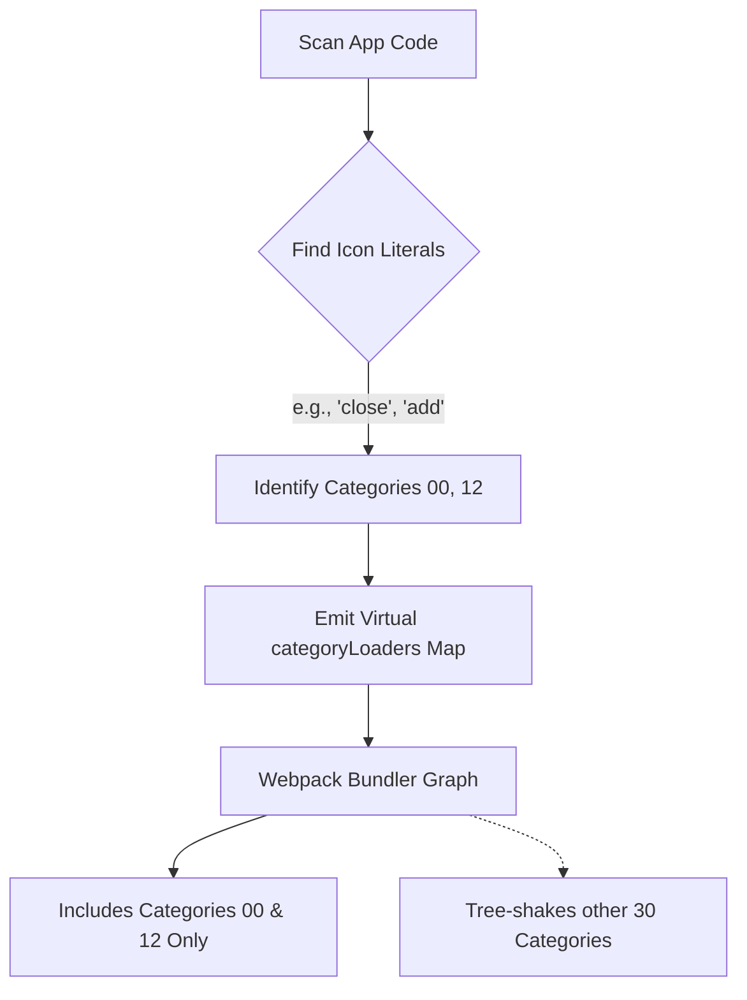

# RFC: Semantic Icon Tree-Shaking via Static Analysis (alpha.11 Candidate)

* **Status:** Proposed
* **Authors:** One UI Engineering Team
* **Target Version:** `0.1.0-alpha.11`

---

## 📖 Executive Summary

While `@jds4/oneui-react` `alpha.10` successfully resolves correctness issues (React peer dependencies, no-plugin fallback loading, and opt-in icon registry bypass), the **default semantic icon pathway** (`<Icon icon="close" />` with default `<BrandProvider>`) remains compilation-heavy. Because the loader references all category loader modules, the bundler must parse the entire ~1,609 icon module graph at build time.

This RFC proposes candidates for **alpha.11+** to enable tree-shaking for default semantic-icon users without breaking the runtime-dynamic API.

---

## 🔴 The Problem: Default-Path Compilation Cost

In `alpha.10`, the icon registration path is pulled in by default via `BrandProvider`:

```ts
// packages/ui/src/components/BrandProvider/BrandProvider.tsx
void ensureIconSetRegistered(iconSet);
// → packages/icons-jio/src/register.ts → loader.ts → categoryLoaders.ts
```

Since `categoryLoaders` is a static map pointing to all 32 category modules, webpack resolves, parses, and traverses all 1,609 individual icon modules to build the module dependency graph, regardless of which icons are actually used.

---

## 💡 Proposed Solutions for alpha.11

We propose two primary directions for compile-time optimization.

---

### Option 1: Webpack / Next.js Plugin Static Analysis (Pruned Loader)

Instead of shipping a static monolithic `categoryLoaders` map, the bundler plugin generates a **pruned registry** dynamically at build time.

#### How It Works

1. During the compiler's compilation pass, `@jds4/oneui-next-plugin` / `@jds4/oneui-webpack-plugin` scans the source directory for string literal icon references:
   - Matches regex patterns such as `icon=["'](Ic[A-Z][a-zA-Z0-9]+|close|add|...)["']`.
2. The plugin intercepts the resolution of `@jds4/oneui-icons-jio/loader` or `@jds4/oneui-icons-jio/categoryLoaders` and injects a **virtual virtual-loader module** containing only the categories or specific icons discovered during the scan.
3. Webpack only resolves the files referenced in the virtual loader. Unused categories/icons are completely omitted from the webpack module graph.

#### Interface Diagram



#### Pros & Cons

* **Pros:** Complete win-win. Authors keep clean `<Icon icon="close" />` syntax while build compile-times drop drastically.
* **Cons:** Dynamic names constructed via templates (e.g. `icon={isActive ? "check" : "close"}`) are harder to resolve statically and require fallback mapping (e.g., loading a default chunk or warning).

---

### Option 2: SWC / Babel Transform (Semantic → Direct Import)

Transform semantic icon calls directly into import nodes before webpack parses the files.

#### How It Works

An SWC or Babel plugin compiles:

```tsx
// Author writes
import { Icon } from '@jds4/oneui-react';
<Icon icon="close" />
```

Into:

```tsx
// Compiled output
import { Icon } from '@jds4/oneui-react';
import { IcClose } from '@jds4/oneui-icons-jio/components/close';
<Icon icon={IcClose} />
```

#### Pros & Cons

* **Pros:** True tree-shaking at the individual icon level (not chunk level), yielding the smallest possible client bundle.
* **Cons:** Requires adding the compiler plugin to the consumer's configuration (Babel/SWC), which isn't always customizable in standard Next.js / Create React App environments. Only works for static strings.

---

### Option 3: Lazy Component-Level Category Loader

Instead of registering all loaders at the root `BrandProvider` level, let individual `<Icon>` components trigger registration dynamically on mount.

```tsx
// packages/ui/src/icons/Icon.tsx
// Dynamic load on mount:
const CategoryModule = await import(`@jds4/oneui-icons-jio/categories/${cat}`);
```

#### Pros & Cons

* **Pros:** No root registration. Pages that render no icons pay zero module graph cost.
* **Cons:** Using template-string dynamic imports creates a Webpack **context module** that includes all files in the directory anyway, yielding ~0 build-time module count reduction (the Risk D1 identified in `implementation-audit.md`).

---

## 🌐 OSS icon packs: plugin-independent, bundler-dependent

Icon registration (`BrandProvider` + `iconSet`) is **orthogonal** to the CDN brand plugin. Consumers can use semantic `<Icon icon="…" />` with **no plugin** as long as the icon peer is installed (Jio baked brand CSS covers the default `brand="jio"` case).

| Icon set | Loader strategy | Vite | Webpack / Next |
| -------- | --------------- | ---- | -------------- |
| `jio` (default) | `@jds4/oneui-icons-jio/register` + category chunks | ✅ | ✅ |
| `lucide` | Per-icon dynamic `import('lucide-react/dist/esm/icons/….js')` | ✅ | ❌ fails today |
| `tabler` | Per-icon dynamic `import('@tabler/icons-react/dist/esm/icons/….mjs')` | ✅ | ❌ fails today |
| `hugeicons` / `phosphor` / `remix` | One-time package-root `import()` | ✅ | ✅ |

**Symptom on Webpack/Next:** dashed-circle placeholders (missing-icon fallback) — not `registerIcons={false}` and not a missing CDN plugin.

**Root cause:** `ensureIconSetRegistered` uses fully dynamic import paths for Lucide/Tabler (`/* @vite-ignore */`). Webpack cannot statically analyze those paths, so runtime resolution fails regardless of whether `@jds4/oneui-*-plugin` is installed.

**Workarounds today:**

- Use `iconSet="jio"` (default) or `hugeicons` / `phosphor` / `remix` for semantic `<Icon />` on Next/Webpack.
- For Lucide on Next: import components directly (`import { Home } from 'lucide-react'`) and pass to `<Icon icon={Home} />`, or wait for the alpha.11 loader fix below.

**Proposed alpha.11 fix (extends this RFC):** switch Lucide/Tabler to the same package-root loader pattern as Phosphor (correctness first; tree-shaking addressed separately via Option 1/2 above), or emit webpack-safe static contexts for per-icon files.

---

## 🛠️ Recommended Action Plan for alpha.11

1. **Short-Term (alpha.11):** Implement **Option 1** (Bundler Plugin Static Analysis) in `@oneui/webpack-plugin` and `@oneui/next-plugin`. Start by pruning unused category chunks based on static string scans, falling back to a full load only when a dynamic/unresolvable template is detected.
2. **Correctness (alpha.11):** Fix Lucide/Tabler semantic `<Icon />` on Webpack/Next (see § OSS icon packs above) so all six supported sets work with and without the CDN plugin.
3. **Medium-Term:** Shrink the non-icon dependency footprint by splitting root barrel files (`index.public`) and narrowing `@base-ui/react` import paths.
