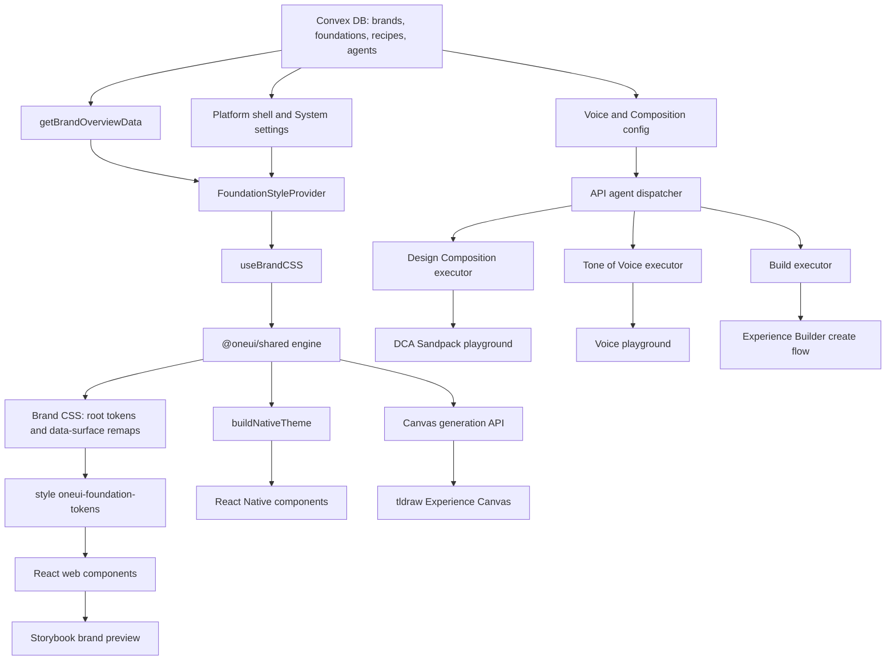
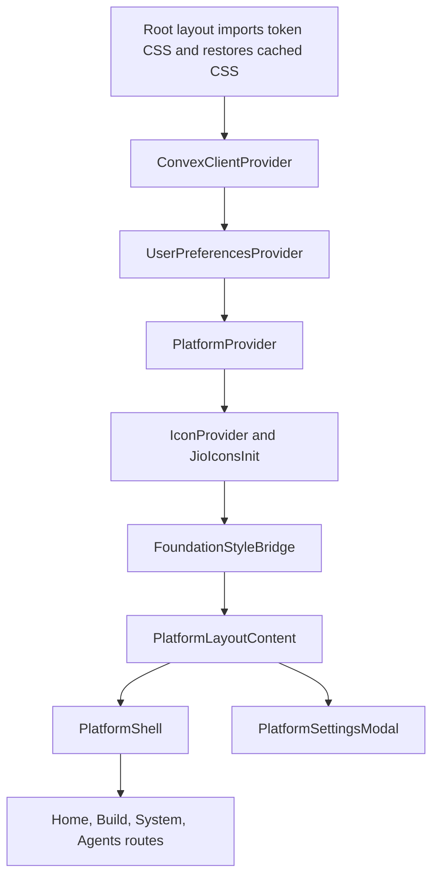
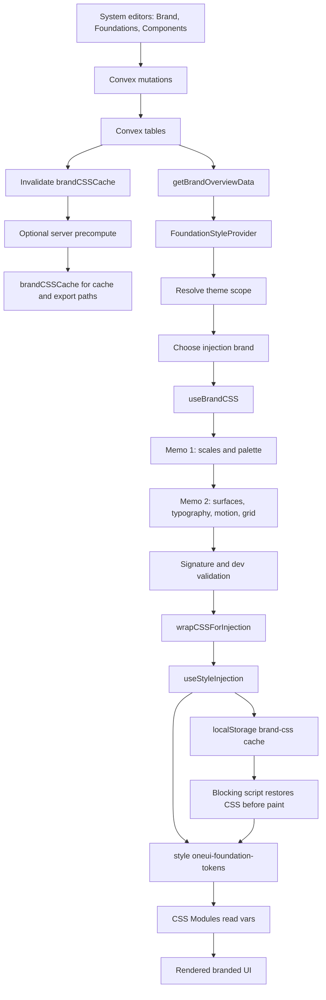
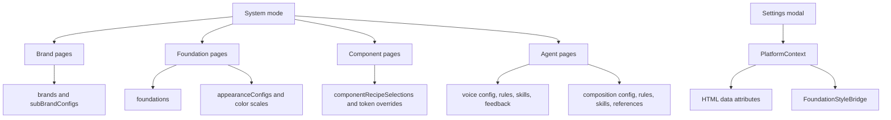
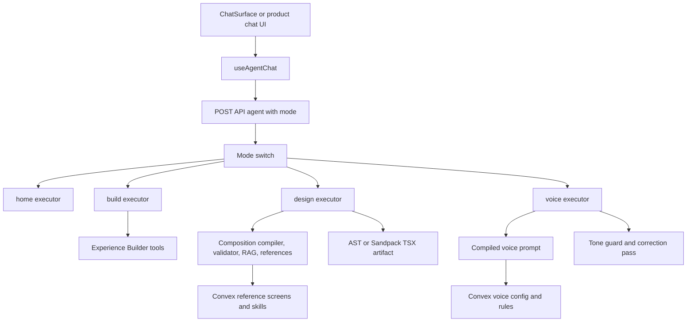
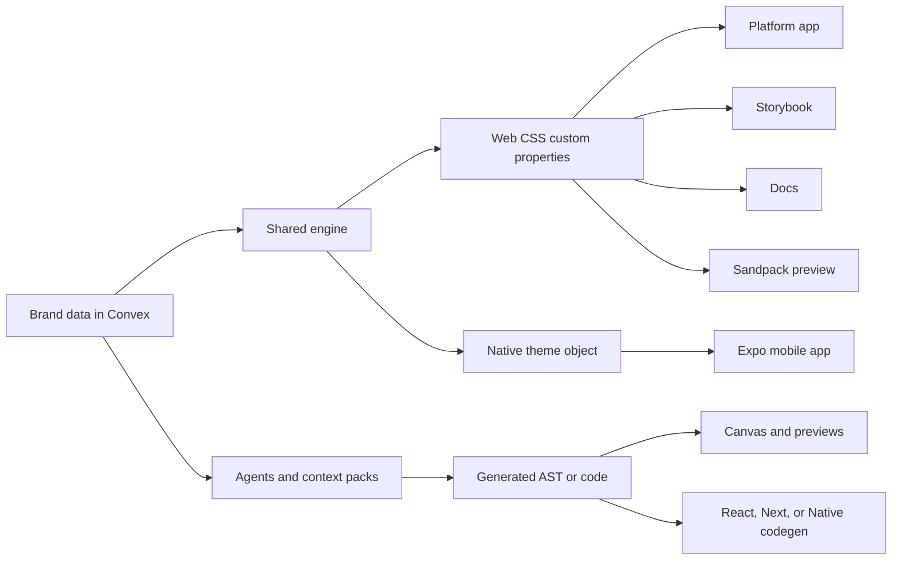

# OneUI Studio System Architecture Overview

This document maps OneUI Studio end-to-end: how a brand is defined, how Convex stores and serves it, how the token engine turns it into live web/native UI, how the platform System areas configure it, and how the canvas/build/agent surfaces connect.

## Executive Map

OneUI Studio is a multi-brand design system platform. The product is a monorepo with a Next.js platform app, an Expo mobile app, Storybook, documentation, a Convex backend, a shared design-token engine, web components, native components, and AI-assisted creation tools.

At runtime, the major loop is:

1. Designers configure a brand in the platform System area.
2. Convex persists brand foundations, appearance roles, component recipes, agent rules, voice rules, reference screens, and feedback.
3. `getBrandOverviewData` returns the current brand shape to clients in one overview query.
4. `useBrandCSS` and `@oneui/shared/engine` generate brand CSS, including surface context remaps.
5. `FoundationStyleProvider` injects the CSS into `style#oneui-foundation-tokens`.
6. Web components consume `var(--Token-Name)` from CSS Modules; native components consume JS theme objects produced by the same shared engine.
7. Storybook, docs, canvas, Sandpack previews, and agents all reuse the same brand data and component metadata.

## Monorepo Shape

The workspace is declared in `pnpm-workspace.yaml` as `packages/*` and `apps/*`, with root scripts in `package.json` orchestrated by Turborepo.

| Area              | Purpose                                                           | Key paths            |
| ----------------- | ----------------------------------------------------------------- | -------------------- |
| Platform app      | Main product shell, System, Build, Agents, canvas, API routes     | `apps/platform`      |
| Mobile app        | Expo consumer of native OneUI runtime                             | `apps/mobile`        |
| Storybook         | Component documentation and live brand preview                    | `apps/storybook`     |
| Docs site         | Documentation consumer                                            | `apps/docs`          |
| Web UI package    | React web components, hooks, runtime, registry, playground bundle | `packages/ui`        |
| Native UI package | React Native theme provider, Surface, Button, materials           | `packages/ui-native` |
| Tokens package    | Static CSS token layers and JS token objects for native           | `packages/tokens`    |
| Shared package    | Pure engine, schemas, codegen, agent compilers, validators        | `packages/shared`    |
| Convex package    | Backend schema, queries, mutations, generated API                 | `packages/convex`    |

Primary technologies:

- Next.js App Router + React 19 for the platform.
- Convex for real-time backend state and generated API types.
- Base UI + CSS Modules for accessible web primitives.
- CSS custom properties and cascade layers for web theming.
- Expo / React Native for mobile.
- Storybook 10 with Vite for component documentation.
- Vercel AI SDK with Anthropic models for agent routes.
- tldraw for the visual Experience Canvas.
- Sandpack for code-based Design Composition Agent previews.

## Platform Runtime Shell

The platform root layout imports the static token cascade, renders the FOUC-prevention style placeholders, restores cached brand CSS, and wraps the app in Convex.

Key files:

- `apps/platform/src/app/layout.tsx`
- `apps/platform/src/app/(platform)/layout.tsx`
- `apps/platform/src/contexts/PlatformContext.tsx`
- `apps/platform/src/contexts/UserPreferencesContext.tsx`
- `apps/platform/src/components/FoundationStyleProvider.tsx`
- `apps/platform/src/config/navigation.tsx`

Provider order in the platform route group:

The main navigation modes are Home, Build, System, and Agents. The System mode is not a single settings route; it is the studio area for brand, foundations, components, and agent configuration.

The global platform state includes:

- Current editing brand and optional sub-brand.
- Theme: `light` or `dark`.
- Density: `compact`, `default`, or `open`.
- Real viewport breakpoint via `data-Breakpoint`.
- Preview platform and breakpoint for scoped previews.
- Theme scope: `preview`, `scoped`, or `global`.
- Platform brand id: the brand whose dimensions, component overrides, fonts, and tool-shell settings apply to the Studio UI.
- Icon set selection.

The initial paint path is deliberately split:

1. Static token CSS is imported in `apps/platform/src/app/layout.tsx`.
2. The HTML shell renders `style#oneui-foundation-tokens`.
3. A blocking script restores `data-theme`, `data-density`, `data-6-Density`, `data-Breakpoint`, `data-theme-scope`, and cached brand CSS from localStorage before paint.
4. React later takes ownership of the same style element through `useStyleInjection`.

## Multi-Brand Data Model

Convex is the source of truth. The high-level brand definition is spread across a few table families in `packages/convex/convex/schema.ts`.

| Table family                                                                            | Role                                                                                                                                      |
| --------------------------------------------------------------------------------------- | ----------------------------------------------------------------------------------------------------------------------------------------- |
| `brands`                                                                                | Brand identity, slug, logo, primary/secondary OkLCH seed values, system/user status                                                       |
| `foundations`                                                                           | Per-brand foundation configs: color, surfaces, typography, dimension, shape, elevation, motion, icons, materials, platforms, voice, grid  |
| `appearanceConfigs`                                                                     | Multi-accent role mapping: primary, secondary, neutral, sparkle, brand-bg, positive, negative, warning, informative                       |
| `colorScales`, `presetColorScales`, `brandPresetScaleSelections`                        | Custom and preset 25-step OkLCH scales                                                                                                    |
| `subBrandConfigs`                                                                       | Sub-brand variants that override primary, secondary, sparkle, and brand-bg while inheriting the parent brand                              |
| `componentRecipeSelections`                                                             | Human-level component recipe decisions per brand                                                                                          |
| `componentTokenOverrides` and related data                                              | Raw/component token override escape hatches and component CSS resolution                                                                  |
| `componentDecorations`, `brandOrnaments`                                                | Brand ornament SVG/decorator configuration                                                                                                |
| `brandCSSCache`                                                                         | Server-precomputed brand CSS per brand and theme, used by cache/export paths                                                              |
| `voiceConfigs`, `voiceRules`, `voiceSkills`, `voicePublications`                        | Tone of Voice agent configuration, rules, skills, and published SDK snapshots                                                             |
| `compositionConfigs`, `compositionRules`, `compositionSkills`                           | Design Composition Agent configuration, modular rules, and skill packs                                                                    |
| `referenceScreens`, `referenceAnalyses`, `renderedScreenshots`                          | Visual reference library and verification artifacts                                                                                       |
| `compositionFeedback`, `voiceFeedback`, eval tables                                     | Feedback and evaluation loops for agents                                                                                                  |
| `contextPackCache`                                                                      | Cached external-agent context packs                                                                                                       |

The important read path is `api.foundations.getBrandOverviewData` in `packages/convex/convex/foundations.ts`. It returns a consolidated overview: foundations, preset selection, appearance config, available platforms, custom fonts, decorations, and related brand data.

Mutations that change foundations, appearance, or component token data invalidate `brandCSSCache`. `packages/convex/convex/brandCSSPrecompute.ts` can then recompute both light and dark CSS server-side through `precomputeBrandCSSNew` from the shared engine. The current platform first-paint bridge also writes generated CSS to localStorage and restores it through the blocking script before React hydrates.

## Brand To Component Flow

The brand-to-pixel path is the core architecture.

Theme scope controls which brand paints the platform:

- `preview` / Default Theme: the platform brand drives injected surface and typography CSS, so the Studio chrome stays on One UI Theme while editing another brand.
- `global` / Brand Theme: the editing brand drives injected CSS, with current sub-brand accents merged into the injection data.
- Dimensions, component overrides, and fonts for the tool shell remain tied to `platformBrandId` through separate subscriptions in `FoundationStyleProvider`.

The generated CSS contains:

- Root role tokens such as `--Primary-Bold`, `--Primary-Subtle`, `--Primary-High`.
- Surface fill tokens and context blocks for `[data-surface]`.
- Typography V2 font, size, line-height, and weight tokens.
- Motion and grid CSS.
- Ornament CSS when Brand Theme is active.
- Optional Google Font imports and font rendering declarations.

## Surface Context

Surface context is how child components adapt to colored, dark, or tinted backgrounds without component-specific inversion logic.

The web pattern is:

1. A container renders `data-surface="bold"` or another mode.
2. Brand CSS emits `[data-surface]` remapping blocks.
3. Components continue to read generic role tokens like `--Primary-Bold`, `--Primary-High`, or `--Primary-TintedA11y`.
4. The cascade remaps those tokens relative to the parent surface.

The native pattern mirrors this in JS:

1. The app mounts `OneUINativeThemeProvider`.
2. Colored regions use native `Surface`.
3. Components call `useSurfaceTokens`, `useTypographyTokens`, and `useOneUITheme`.
4. The shared engine resolves the same role/surface concepts into native theme objects instead of CSS.

## Component Library And Platform Consumers

### React Web

`packages/ui` provides React components built on Base UI and CSS Modules. Components are exported through package subpaths such as:

- `@oneui/ui/components/Button`
- `@oneui/ui/hooks/useBrandCSS`
- `@oneui/ui/engine`
- `@oneui/ui/registry/*`
- `@oneui/ui/playground/*`

The web package owns:

- Component implementations and stories.
- Component registry and metadata.
- Runtime hooks such as `useBrandCSS`, `useStyleInjection`, `useBrandFonts`, and surface-token helpers.
- The Sandpack playground bundle exported through `packages/ui/src/playground/*`.
- Shared component prop barrels such as `components/*/shared` for native parity.

Web styling has two inputs:

1. Static tokens from `@oneui/tokens/css/*`, imported in the correct cascade order.
2. Dynamic brand CSS injected by `FoundationStyleProvider` or Storybook's `BrandStyleInjector`.

### React Native

`packages/ui-native` provides the native runtime and component implementations. It exports:

- `OneUINativeThemeProvider`
- `Surface`
- `useSurfaceTokens`
- `useSurfaceContext`
- `useTypographyTokens`
- `buildNativeTheme`
- Native components such as `Button`
- Material components such as `TranslucentView`, `FrostedView`, `GlassView`, and `MetallicView`

Native components import shared web prop/type definitions where possible, then consume:

- `@oneui/tokens` JS objects for static spacing, shape, motion, and defaults.
- `@oneui/shared/engine` for brand-native theme generation.
- `useSurfaceTokens` for context-aware colors.

The parity gate is `scripts/check-parity.ts`. It checks that web and native component files exist in expected pairs and that native implementations import shared prop contracts from `@oneui/ui/components/<Component>/shared`.

### Storybook

Storybook imports the same static token CSS cascade in `apps/storybook/.storybook/preview.ts`. `BrandStyleInjector` in `apps/storybook/.storybook/BrandStyleDecorator.tsx` mirrors the platform:

- Queries `getBrandOverviewData`.
- Calls `useBrandCSS` with `injectionMode: 'global'`.
- Injects `storybook-brand-tokens`.
- Generates brand dimension CSS.
- Loads fonts.
- Queries component recipe/token data and injects component override CSS.
- Provides decoration and brand logo context.

This makes Storybook a live brand preview rather than static documentation.

## System Configuration Surface

The System section of the platform configures the data that powers the whole runtime.

Major configurable axes:

- Brand identity and active brand/sub-brand.
- Color and appearance roles.
- Surface behavior and theme-specific background steps.
- Typography and custom fonts.
- Platform breakpoints, dimensions, density, grid.
- Motion, shape, elevation, icons, materials.
- Component recipe selections and token overrides.
- Decorations and ornaments.
- Theme scope, density, platform brand, and icon set through the settings modal.
- Tone of Voice config, voice rules, skills, evaluation, feedback.
- Design Composition config, composition rules, skills, reference screens, evaluation, feedback.

## Canvas, Draw, Build, And Composition Playgrounds

There are two major creation surfaces plus the Build agent flow.

### tldraw Experience Canvas

The visual canvas is implemented with tldraw.

Key paths:

- `apps/platform/src/app/(platform)/(builder)/canvas/page.tsx`
- `apps/platform/src/app/(platform)/(builder)/canvas/CanvasContent.tsx`
- `apps/platform/src/design-tools/ExperienceCanvas/ExperienceCanvas.tsx`
- `apps/platform/src/design-tools/ExperienceCanvas/useCanvasChat.ts`
- `apps/platform/src/design-tools/ExperienceCanvas/useCanvasEditor.ts`
- `apps/platform/src/app/api/canvas/generate/route.ts`

The canvas uses custom shape utils:

- Component shapes render real OneUI components.
- Container shapes render `data-surface` containers.
- OneUI frame shapes represent artboards.
- Sketch HTML shapes render generated ASTs in iframe-like previews.

The canvas can:

- Place components from the registry.
- Insert templates from `@oneui/shared/templates`.
- Convert canvas state into a OneUI AST with `canvasToAST`.
- Export React, Next page, or React Native code via `@oneui/shared/codegen`.
- Call `/api/canvas/generate` for AI-generated ASTs.
- Open ASTs handed off from the Design Composition playground through localStorage key `oneui:composition-playground:open-ast`.

### Design Composition Agent Playground

The Design Composition Agent playground lives under:

- `apps/platform/src/app/(platform)/(studio)/agents/design-composition/playground/page.tsx`
- `apps/platform/src/app/(platform)/(studio)/agents/design-composition/playground/CanvasPanel.tsx`
- `packages/ui/src/playground/template.ts`
- `packages/ui/src/playground/entry.tsx`
- `packages/ui/vite.playground.config.ts`

It is an artifact-first chat UI:

- Chat sends requests through `useAgentChat({ mode: 'design' })`.
- The right panel renders either AST output or Sandpack TSX output.
- `renderer: 'ast'` returns a JSON AST.
- `renderer: 'sandpack'` returns TSX for the Sandpack preview bundle.
- Revision mode sends `previousAST` or `previousCode` plus selected node metadata so the server can revise rather than rebuild.
- Explore and phased flows call additional canvas/composition APIs.
- Visual verification data comes back through `renderedScreenshots` and composition feedback/evaluation tables.

### Build Agent Flow

The Build mode is separate from DCA. It is the Experience Builder / creation assistant path:

- Client surfaces call `useAgentChat({ mode: 'build' })`.
- `/api/agent` routes to `executors/build.ts`.
- The executor builds a create-system prompt from brand context, selected platforms, token CSS, project context, and existing assets.
- It streams with AI SDK `streamText` and builder tools from `apps/platform/src/app/(platform)/(builder)/create/lib/tools`.

## Agents And AI Architecture

All primary chat modes use one dispatcher:

- `apps/platform/src/lib/agentRoutes.ts`
- `apps/platform/src/hooks/useAgentChat.ts`
- `apps/platform/src/app/api/agent/route.ts`
- `apps/platform/src/app/api/agent/executors/*`

### Home Agent

The Home assistant uses the same `/api/agent` dispatcher with `mode: 'home'`. Recent threads are loaded from Convex through `api.agentChat.listThreads` when the platform mode is Home.

### Design Composition Agent

The DCA executor is `apps/platform/src/app/api/agent/executors/design.ts`.

Inputs can include:

- Chat messages.
- Brand name and brand id.
- Composition context: `mobile-app`, `web-app`, `marketing-page`, `social-post`, `print`, `outdoor`.
- Client-compiled prompt, rules, config, skills, and component reference.
- Reference screen hints and pinned reference ids.
- Renderer mode: AST or Sandpack TSX.
- Previous AST/code and selected node metadata for revisions.
- Optional external `DESIGN.md`.

The executor uses `@oneui/shared/engine` for composition compilation, seed rules, validation, AST normalization, TSX prompt building, RAG retrieval, reference resolution, and DESIGN.md support.

The phrase "DL draw/build" does not correspond to a distinct feature name in the repo. The closest actual paths are:

- DCA print context examples such as a DL flyer.
- The broader Design Composition Agent.
- The tldraw Experience Canvas.
- The Build agent / Experience Builder create flow.

### Tone Of Voice Agent

The Tone of Voice surfaces live under `apps/platform/src/app/(platform)/(studio)/agents/tone-of-voice`.

The executor is `apps/platform/src/app/api/agent/executors/voice.ts`.

Flow:

1. The configuration page reads and updates `voiceConfigs`.
2. Rules merge from the system brand and brand-specific overrides.
3. Skills and publications are managed in Convex.
4. The playground calls `useAgentChat({ mode: 'voice' })`.
5. The executor streams or performs a two-pass generation.
6. `runToneGuard` checks the output against deterministic rules.
7. Fixable violations trigger a correction pass.
8. Feedback and eval results flow back to Convex.

### External Agent Context Pack

`apps/platform/src/app/api/agent/context-pack/route.ts` is the synchronous endpoint for external agents and MCP/code-generation clients.

It accepts brand, vertical, archetype, context, optional skill id, and optional user prompt, then returns a budgeted system prompt plus reference images and citations. Results are cached in `contextPackCache`.

## End-To-End Consumer Flow

## Important Invariants

- Static token CSS order matters: layers, dimensions, grid, typography, primitives, semantic, light/dark, density.
- `style#oneui-foundation-tokens` is shared by the blocking script and React injection. Do not replace it with a different id.
- `useBrandCSS` returns `null` while loading and `''` for intentional empty CSS. Callers must preserve that distinction.
- `FoundationStyleProvider` holds previous CSS while Convex data loads so brand switches do not blank the UI.
- `data-surface` is required for context-aware component adaptation on colored/tinted/dark surfaces.
- Theme scope chooses which brand drives global surface/typography CSS; it is separate from the platform brand used for tool-shell dimensions and component overrides.
- Convex `getBrandOverviewData` is the main consolidated brand read path. Avoid duplicating foundation subscriptions for the same consumer tree.
- Component recipe selections store decisions, not resolved CSS.
- Storybook must use the same `useBrandCSS` and component override path as the platform.
- Native parity depends on shared prop barrels and `scripts/check-parity.ts`.
- Agent routes use the single `/api/agent` dispatcher with `home`, `build`, `design`, and `voice` modes.

## Known Scope Notes

- The in-product drawing canvas is tldraw.
- No separate feature named `DL draw` was found. The nearest concrete features are DCA print/DL flyer prompts, tldraw canvas generation, and the Build agent create flow.
- Active agents in the UI are Tone of Voice and Design Composition. Image Generation and Code Quality are listed as coming soon in the Agents hub.
